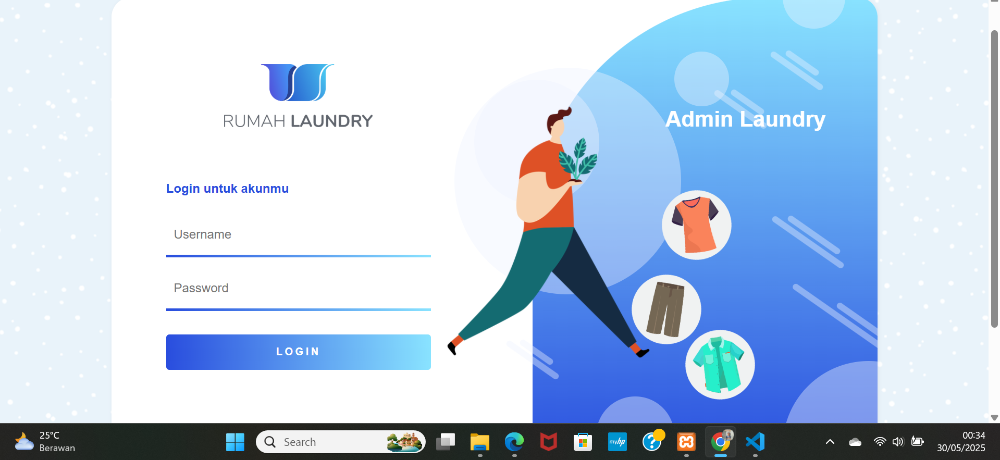

# 🧺 Aplikasi Web Laundry

Aplikasi ini adalah sistem manajemen laundry berbasis web yang dikembangkan dengan PHP dan MySQL. Mendukung fitur login, manajemen pelanggan, transaksi laundry, dan laporan.

## 📸 Tampilan Antarmuka

- setelah download. extract file zip yang sudah didownload. masukkan kedalam satu folder. dan beri nama rumah_laundry.
- copy atau cut folder rumah_laundry ke xampp/htdocs/ kemudian paste.
  
## ⚙️ Instalasi
1. Aktifkan web server bisa menggunakan LAMP, XAMPP, WAMPP, dll.
	Lalu aktifkan apache dan mysql.
2. Buka web browser, ketikkan localhost/phpmyadmin pada address bar.
3. Buat sebuah database dengan nama laundry_app.
4. Setelah database dibuat, klik database laundry_app.
5. Import file sql dengan cara klik menu/tab impor pada bagian atas phpmyadmin.
6. klik Choose file, lalu cari file laundry_app.sql yang sudah disediakan, terakhir klik tombol kirim/go (scroll ke bawah).
7. Buka tab baru pada web browser kemudian ketikkan localhost/rumah_laundry/
8. Terakhir, login terlebih dahulu isi username dan password:
   username: admin
   password: admin
